Modeling the number of new scientific discoveries published over time
================
Erick Lu

April 3, 2020

-   [Introduction](#introduction)
-   [Exploratory data analysis](#exploratory-data-analysis)
-   [Acquiring an approximately stationary series](#acquiring-an-approximately-stationary-series)
-   [Fitting the seasonal ARIMA model](#fitting-the-seasonal-arima-model)
-   [Model diagnostics - checking the assumptions](#model-diagnostics---checking-the-assumptions)
-   [Some spectral analysis](#some-spectral-analysis)
-   [Discussion and conclusions](#discussion-and-conclusions)
-   [References](#references)

Introduction
------------

Here, I will use integrated autoregressive moving average (ARIMA) models to model the number of scientific papers published in the field of cancer research over time. Modeling the behavior of the academic publication process may provide insight and understanding on the progress of research, as well as reveal the productivity patterns of those who work the field.

The data we will be working with consists of monthly counts of the number of scientific papers published in the field of cancer research from January 1964 to December 2011. In order to obtain the data, I wrote a [Python script](https://github.com/erilu/pubmed-abstract-compiler) that uses the NCBI E-utilities to search PubMed for cancer research articles and download their abstracts. 2,135,309 abstracts pertaining to cancer research were downloaded and the month and year of each abstract was extracted using regular expressions. The number of scientific articles released for each month of each year was tallied to make the time series. There are a total of 576 equispaced data points.

Exploratory data analysis
-------------------------

I will use the `TSA` package in R to explore and model the time series data. Looking at a plot of the raw data, we observe an increasing trend as well as a seasonal pattern:

``` r
library(TSA)
data <- read.csv("papers_published_per_month.csv", header = T, row.names = 1)
complete_ts <- ts(data$count, frequency = 12, start = min(data$year))
plot(complete_ts, ylab = "Papers Published Per Month", type = "l", xlab = "Year")
```

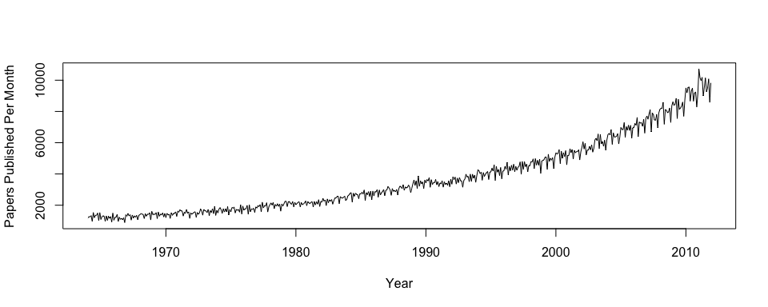

To better observe the seasonal pattern of the data, we will zoom in between 2005 and 2010 and add monthly symbols to the plot:

``` r
partial_ts <- ts(data[which(data$year>=2005 & data$year<=2010),3], frequency = 12, start =2005)
plot(partial_ts, ylab = "Papers Published Per Month", type = "l", xlab = "Year")
points (y = partial_ts, x = time(partial_ts), pch= as.vector(season(partial_ts)), cex = 1.5)
```

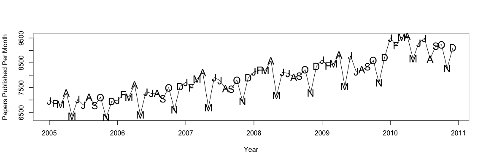

Values for the number of papers published seem to be lowest in May and November of each year, and highest in the months preceeding them. Explanations for this behavior may be due to decreased productivity during the summer and winter holidays, and increased productivity in the spring due to PhD students who are pressured to publish before graduating. We can look at the underlying structure of the data using `stl` (seasonal decomposition of time series by Loess):

``` r
plot(stl(complete_ts, "periodic"))
```

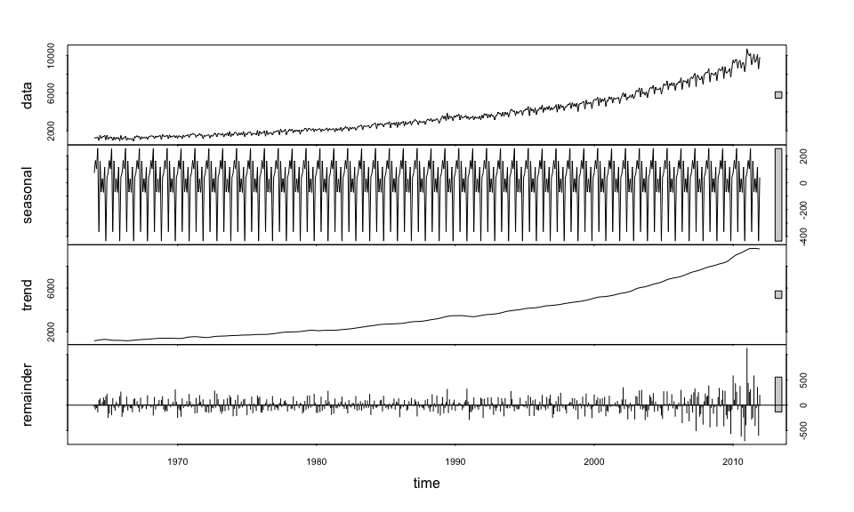

This graph shows the raw data (top row), seasonal pattern (second row), the fitted trendline using Loess (third row), and residuals (bottom row). The repeating pattern in the second row verifies the seasonal pattern we observered earlier in the raw data. We can also see that the variance in the residuals greatly increases from 2009 and onward.

In order to satisfy the constant variance assumption when fitting ARIMA models, we will apply a transformation to the time series to stabilize the variance. A popular technique is the power transformation, introduced by Box and Cox (1964), in which the data, *y*, is transformed to $g(y) = \\frac{ y^{\\lambda} - 1}{\\lambda}$ for *λ* ≠ 0 and log(*y*) for *λ* = 0. We may construct a maximum likelihood plot for *λ* in order to determine the order of the power transformation:

``` r
BoxCox.ar(complete_ts,method = 'ols',lambda = seq(0.36,.65,0.01))
```

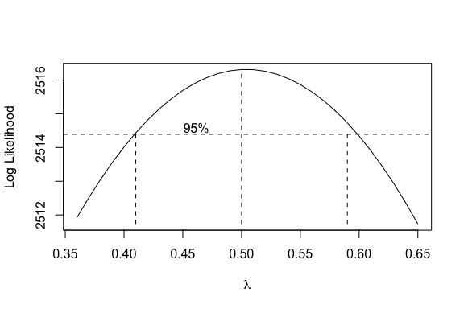

The maximum likelihood estimate for lambda based on our time series is 0.5, suggesting that we can use a square root transformation of the data for modeling purposes.

Acquiring an approximately stationary series
--------------------------------------------

Now that we have observed the behavior of the data, we will attempt to transform the series into something approximately stationary, in order to be able to satisfy the stationarity required for fitting ARIMA models. In addition to stabilizing the variance with the square root transformation, we will remove the mean level of the process by taking the first difference of the Box-Cox transformed data. Below is a plot of the first difference of the square root of the data over time.

``` r
first_diff_ts <- diff(sqrt(complete_ts))
plot (first_diff_ts, ylab = "First Difference of Square Root Counts", xlab = "Year")
abline(h = 0, col = "red")
```

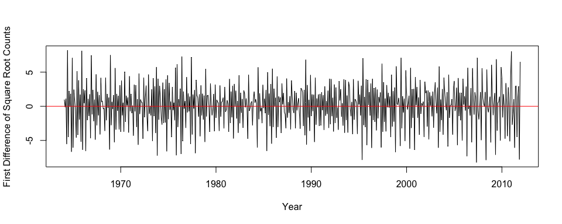

The time series of the first difference of the square root appears to have zero mean and have roughly constant variance. However, strong seasonality is sill present, as evidenced by the sample autocorrelation function below. The sample ACF displays a repeating pattern of peaks at multiples of 6, suggesting that seasonal differencing may be required to achieve an approximately stationary series.

``` r
par(mfrow = c(1,2))
acf (first_diff_ts, lag.max = 50, main = "")
pacf (first_diff_ts,lag.max = 50, main = "")
```

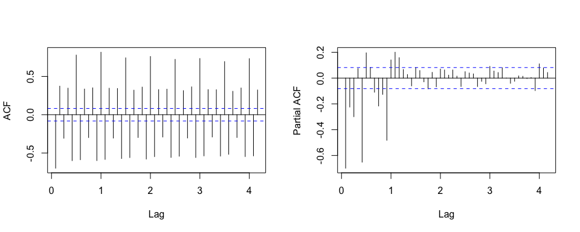

This can be explained by the biannual oscillations seen each year in the raw data. However, if we observe the seasonal decomposition plot closely, the two peaks have slightly different behavior, in which values from February to April behave differently than values from August to October. Thus, I will be using a seasonal lag of 12 instead of 6, to account for the different behavior observed. The information we have discovered so far points toward fitting a seasonal ARIMA model to the data. The effects of seasonal differencing (s = 12) are shown in the plots below, in which we plot the first and seasonal difference of square root transformed data.

``` r
first_and_seasonal_diff_ts <- diff(diff(sqrt(complete_ts)),lag = 12)
par(mfrow = c(1,3))
years = rep (seq(1,12,1), 48)
boxplot (first_diff_ts ~ years[-1] , xlab = "Month", ylab = "First Difference of Square Root", main = "Before Seasonal Difference")
boxplot(first_and_seasonal_diff_ts ~ years[-c(1:13)], xlab = "Month", ylab = "First and Seasonal Difference of Square Root", main = "After Seasonal Difference")
plot (first_and_seasonal_diff_ts, ylab = "First and Seasonal Difference of Square Root Counts", xlab = "Year", main = "First and Seasonal Difference")
abline( h = 0, col = "red")
```

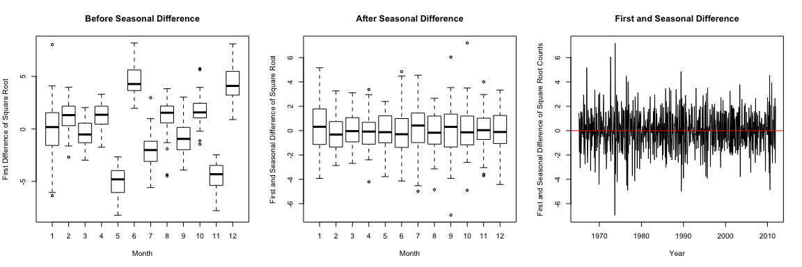

After taking the seasonal difference of the data with period 12, a plot of the data (far right) looks approximately stationary. Judging by the box plots, the seasonal difference has removed most of the variability between months in the data. However, the sample ACF and PACF of the data after first and seasonal differencing shows that seasonal autocorrelation still exists at multiples of lag 12, shown below.

``` r
par(mfrow = c(1,2))
acf(first_and_seasonal_diff_ts, lag.max = 40, main = "")
pacf(first_and_seasonal_diff_ts,lag.max = 60, main = "")
```

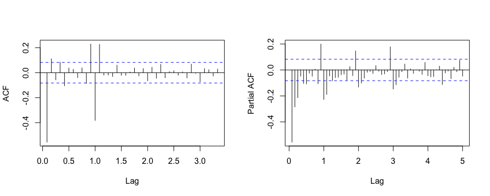

The sample ACF and PACF of the first and seasonal difference both exhibit significant nonseasonal and seasonal autocorrelation. Based on our analysis so far, the data appear to behave according to a multiplicative seasonal ARIMA model with period 12. The nonseasonal and seasonal autocorrelation cuts off after 1 and 12 respectively, whereas the nonseasonal and seasonal partial autocorrelation cuts off at lags 3 and 36, respectively. We will try to fit a model according to these assumptions in the next section.

Fitting the seasonal ARIMA model
--------------------------------

To fit a multiplicative seasonal ARIMA model, we can use the `arima` function in R. Fitting this model requires optimization of several parameters, based on the theory behind the model. If *y*<sub>1</sub>,..., *y*<sub>*t*</sub> is a discrete equispaced time series, an ARIMA (*p*, *d*, *q*)×(*P*, *D*, *Q*)<sub>*s*</sub> model for *y*<sub>*t*</sub> with seasonal period *s* is:

$$\\phi\_p\\left(B\\right)\\Phi\_P(B^{s})\\nabla^{d} \\nabla^{D}\_{s}y^{\\left(\\lambda\\right)}\_{t}  = \\theta\_q(B)\\Theta\_Q(B^{s})e\_t\\hspace {15em} (1)$$
 where *y*<sub>*t*</sub><sup>(*λ*)</sup> is an appropriate transformation of *y*<sub>*t*</sub>, and *e*<sub>*t*</sub> is normal white noise. *ϕ*<sub>*p*</sub>(*B*) and *Φ*<sub>*P*</sub>(*B*<sup>*s*</sup>) are nonseasonal and seasonal AR polynomials of order *p* and *P*, respectively. *θ*<sub>*q*</sub>(*B*) and *Θ*<sub>*Q*</sub>(*B*<sup>*s*</sup>) are nonseasonal and seasonal MA polynomials of order *q* and *Q*, respectively. In order to find the optimal values for *p*, *P*, *q* and *Q*, we will use R to fit all combinations of models with 0 ≤ *p* ≤ 3, *d* = 1 (for first difference), 0 ≤ *q* ≤ 3, 0 ≤ *P* ≤ 3, *D* = 1 (for seasonal difference), 0 ≤ *Q* ≤ 3, and *s* = 12, and find the model that minimizes the AIC (Akaike's Information Criteria).

To do so, we will generate all possible combinations of the four parameters *p*, *P*, *q* and *Q* above using `expand.grid`, then calculate the AIC values for each model:

``` r
coefs <- expand.grid(p = seq(0,3),P = seq(0,3),q = seq(0,3),Q = seq(0,3))
aic_values <- data.frame()
for (i in 1:dim(coefs)[1]){
  mod = try(arima(sqrt(complete_ts), order = c(coefs$p[i],1,coefs$q[i]),seasonal=list(order=c(coefs$P[i],1,coefs$Q[i]),period=12)))
  if (is(mod,"try-error")){
    print(paste(i, "- Error fitting model for parameters:", coefs$p[i], coefs$P[i], coefs$q[i], coefs$Q[i]))
  }
  else {
    aic <- mod$aic
    aic_values <- rbind(aic_values, cbind(coefs[i,], aic))
    print(paste(i, "- AIC calculated for parameters:", coefs$p[i], coefs$P[i], coefs$q[i], coefs$Q[i]))
  }
}
# write.csv(aic_values, file = "aic_values.csv")
```

The parameters for the models with the lowest AIC values are:

``` r
head(aic_values[order(aic_values$aic),])
```

    ##     p P q Q      aic
    ## 216 2 2 1 3 1724.912
    ## 184 1 2 3 2 1728.660
    ## 169 2 2 2 2 1728.974
    ## 185 2 2 3 2 1730.944
    ## 230 2 2 2 3 1730.970
    ## 220 3 3 1 3 1731.070

We want to select a model that minimizes the AIC value but also has a relatively low number of predictors variables, to lower effects of overfitting. Based on the results above, the optimal values for the parameters are *p* = 2, *P* = 2, *q* = 1, and *Q* = 3.

We will fit a multiplicative, seasonal ARIMA (2, 1, 1)×(2, 1, 3)<sub>12</sub> model to the transformed data, which follows the following formula:

$$\\bf {( 1 - \\phi\_1 B^1 - \\phi\_2 B^2 ) (1 - \\Phi\_1 B^{12}  - \\Phi\_2 B^{24} ) \\nabla^{1} \\nabla^{1}\_{12}y^{\\left(1/2\\right)}\_{t} = ( 1 - \\theta\_1 B ) ( 1 - \\Theta\_1 B^{12} - \\Theta\_2 B^{24} - \\Theta\_3 B^{36} )e\_t}$$
 To fit this model this in R, we will use the `arima` function, which should provide values for *ϕ*<sub>1</sub>, *ϕ*<sub>2</sub>, *Φ*<sub>1</sub>, *Φ*<sub>2</sub>, *θ*<sub>1</sub>, *Θ*<sub>1</sub>, *Θ*<sub>2</sub>, and *Θ*<sub>3</sub>, labeled as as ar1, ar2, sar1, sar2, ma1, sma1, sma2, and sma3, respectively.

``` r
arima_model = arima(sqrt(complete_ts), order = c(2,1,1), seasonal=list(order=c(2,1,3),period=12))
```

``` r
arima_model
```

    ##
    ## Call:
    ## arima(x = sqrt(complete_ts), order = c(2, 1, 1), seasonal = list(order = c(2,
    ##     1, 3), period = 12))
    ##
    ## Coefficients:

    ## Warning in sqrt(diag(x$var.coef)): NaNs produced

    ##           ar1     ar2      ma1    sar1    sar2     sma1    sma2     sma3
    ##       -0.0135  0.1429  -0.8334  0.7743  -0.999  -1.5314  1.5698  -0.7492
    ## s.e.   0.0593  0.0473   0.0400     NaN     NaN      NaN     NaN   0.0231
    ##
    ## sigma^2 estimated as 1.14:  log likelihood = -854.46,  aic = 1724.91

We observe that there is an issue with calculating the standard error for some of the parameters. Checking for possible outliers in the data that may interfere with the modeling, we discover two points that may be innovative outliers (IO):

``` r
detectIO(arima_model)
```

    ##              [,1]       [,2]
    ## ind     37.000000 565.000000
    ## lambda1  3.999612   4.689232

We can pass the innovative outliers at points 37 and 565 to the `io=` argument of the `arima` function so that it will account for the variability introduced by these points:

``` r
final_model = arima(sqrt(complete_ts), order=c(2,1,1), seasonal=list(order=c(2,1,3),period=12), io = c(37, 565))
```

``` r
final_model
```

    ##
    ## Call:
    ## arima(x = sqrt(complete_ts), order = c(2, 1, 1), seasonal = list(order = c(2,
    ##     1, 3), period = 12), io = c(37, 565))
    ##
    ## Coefficients:
    ##           ar1     ar2      ma1    sar1     sar2     sma1    sma2     sma3
    ##       -0.0120  0.1431  -0.8291  0.7426  -0.9848  -1.4954  1.4971  -0.7271
    ## s.e.   0.0706  0.0621   0.0533  0.0295   0.0204   0.0509  0.0692   0.0480
    ##        IO.37  IO.565
    ##       3.3674  5.2908
    ## s.e.  1.2277  1.1033
    ##
    ## sigma^2 estimated as 1.109:  log likelihood = -839.5,  aic = 1699.01

The modeling seems to have been successful now. We observe that the AIC is even lower, and the s.e. values are no longer null values. The standard errors of the coefficients are all relatively small. The values of the estimated coefficients are as follows:

| Coefficient | *ϕ*<sub>1</sub> | *ϕ*<sub>2</sub> | *Φ*<sub>1</sub> | *Φ*<sub>2</sub> | *θ*<sub>1</sub> | *Θ*<sub>1</sub> | *Θ*<sub>2</sub> | *Θ*<sub>3</sub> |
|-------------|-----------------|-----------------|-----------------|-----------------|-----------------|-----------------|-----------------|-----------------|
| Estimate    | -0.0120         | 0.1431          | 0.7426          | -0.9848         | -0.8291         | -1.4954         | 1.4971          | -0.7271         |
| St. Error   | 0.0706          | 0.0621          | 0.0295          | 0.0204          | 0.0533          | 0.0509          | 0.0692          | 0.0480          |

Model diagnostics - checking the assumptions
--------------------------------------------

Residual analysis will be used to assess the fit of the model. We must check the assumption that the residuals are uncorrelated and normally distributed. The raw periodogram of the residuals does not contain any large signal peaks and has no apparent pattern, and the majority of the peaks are within the 95% confidence interval, suggesting that the model may fit well.

``` r
TSA::spec(final_model$residuals, main = "Periodogram of Residuals")
```

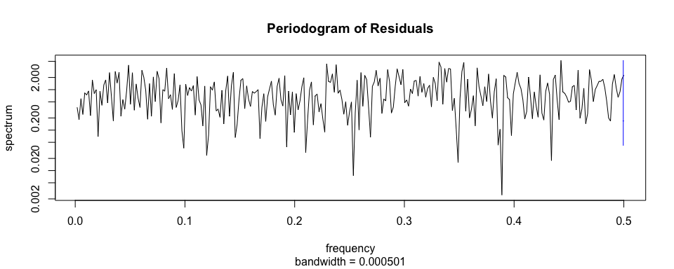

In addition, there is no apparent pattern in the residuals vs. fitted plot, and low autocorrelation in the residuals.

``` r
par(mfrow=c(1,2))
plot(final_model$residuals ~ fitted(final_model), main='Residuals Vs. Fitted', ylab = "Residual", xlab = "Fitted Value")
abline( h = 3, lty= 'dotted', col = 'blue')
abline (h = -3, lty= 'dotted', col = 'blue')
abline (h = 0, col = 'red')
acf(final_model$residuals, main='Sample ACF of Residuals', lag.max=20)
```

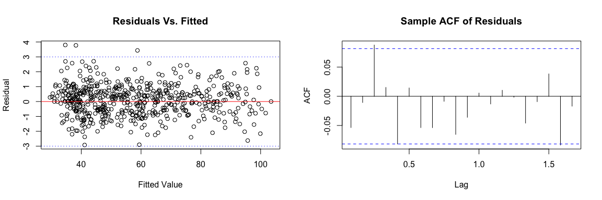

The Normal QQ plot shows that the residuals follow roughly a normal distribution. However, there is a slight deviation from the line in the larger quantiles.

``` r
qqnorm(final_model$residuals, main='Q-Q Plot of Estimated Residuals')
qqline(final_model$residuals, col = "red")
```


P-values for the Ljung-Box statistic for lags 1 through 20 all fail to reject the null hypothesis that the error terms are uncorrelated:

``` r
pval <- vector(length = 20)
for (i in 1:length(pval)){
  b1 <- Box.test(final_model$residuals, lag=i, type="Ljung")
  pval[i]<- b1$p.value
}
pval<0.05
```

    ##  [1] FALSE FALSE FALSE FALSE FALSE FALSE FALSE FALSE FALSE FALSE FALSE FALSE
    ## [13] FALSE FALSE FALSE FALSE FALSE FALSE FALSE FALSE

Overall, it seems that the model satisfies the assumptions and is a fairly good fit.

Some spectral analysis
----------------------

In order to provide additional information on whether a seasonal ARIMA model is appropriate for the data, I will compare the sample spectral density of the first and seasonal difference of the transformed data (blue dashed line) to the theoretical spectral density of the ARIMA (2, 1, 1)×(2, 1, 3)<sub>12</sub> model using the coefficients provided earlier (solid red line). The sample spectral density was smoothed with Daniell window m = 8.

``` r
sp = TSA::spec(first_and_seasonal_diff_ts, spans = 8, lty = 'dashed', ci.plot=T, col = "blue", main = "")
f = seq(0.001,0.5,by = 0.009)
lines (f, ARMAspec(model = list(ar = final_model$coef[grep("^ar", names(final_model$coef))], ma = final_model$coef[grep("^ma", names(final_model$coef))], seasonal = list(sar=  final_model$coef[grep("^sar", names(final_model$coef))], sma = final_model$coef[grep("^sma", names(final_model$coef))], period = 12)), freq = f, plot = F)$spec, lty="solid", col = "red")
```

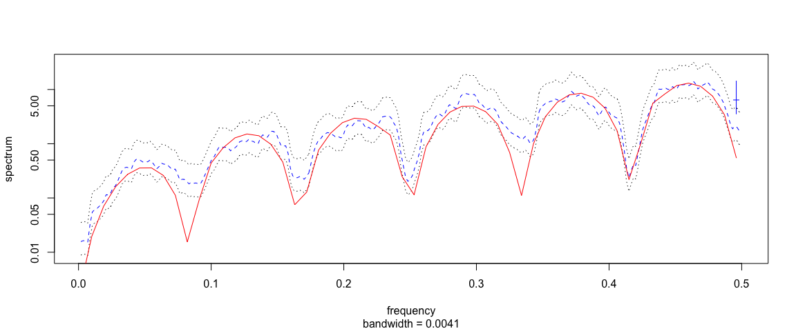

The theoretical spectral density lies within the 95% confidence interval for a vast majority of the frequencies, except for the troughs at frequecies of multiples of 1/12. This may be because the sudden drops were covered up by smoothing. These results support that the model is fitting the data nicely.

Discussion and conclusions
--------------------------

The number of papers published in the field of cancer research over time can be modeled using a seasonal ARIMA (2, 1, 1)×(2, 1, 3)<sub>12</sub> model on the square root of the counts. The estimated coefficients for the model were calculated and the fit was assessed by examining the residuals. We may use this model to predict the number of cancer research articles that will be published in a given month of a given year.

What else can we do with this model? Surprisingly, we found that there was seasonality associated with the number of papers published, with significantly fewer papers published in May and November of each year. Given this trend, can we gain insight into when the optimal time to submit a paper on cancer might be? Having been through the scientific publication process myself, I find the usefulness of this model to be questionable. We do not have the data for the total number of papers that were submitted to journals, only those that actually got published. Furthermore, each paper must be peer-reviewed, which often can have drastically varied timeframes depending on which reviewers were selected. Because of these caveats, it is difficult to find a practical use for this model in terms of predicting when might be the best time to submit a paper. If data on the number of papers submitted per month can be obtained, future analysis on the proportion of papers accepted and published may yield results with better interpretive value.

References
----------

Cryer, J.D. and Chan, K. Time Series Analysis With Applications in R. Springer Texts in Statistics. 2008. Hipel KW, et. al. ”Advances in Box-Jenkins Modeling.” Water Resources Research Vol. 13 No. 3. (1977).
